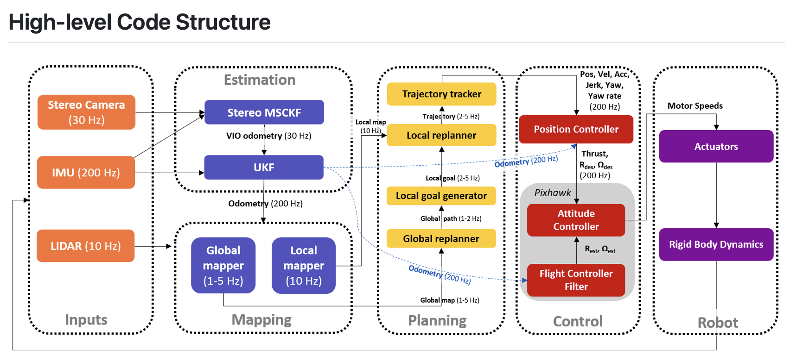
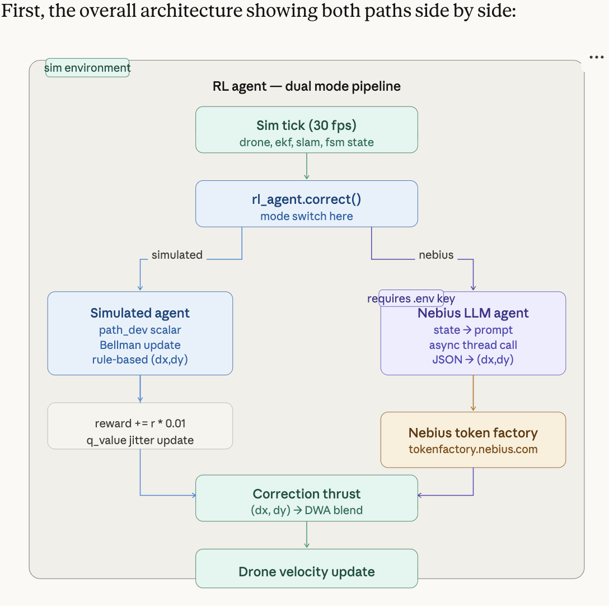
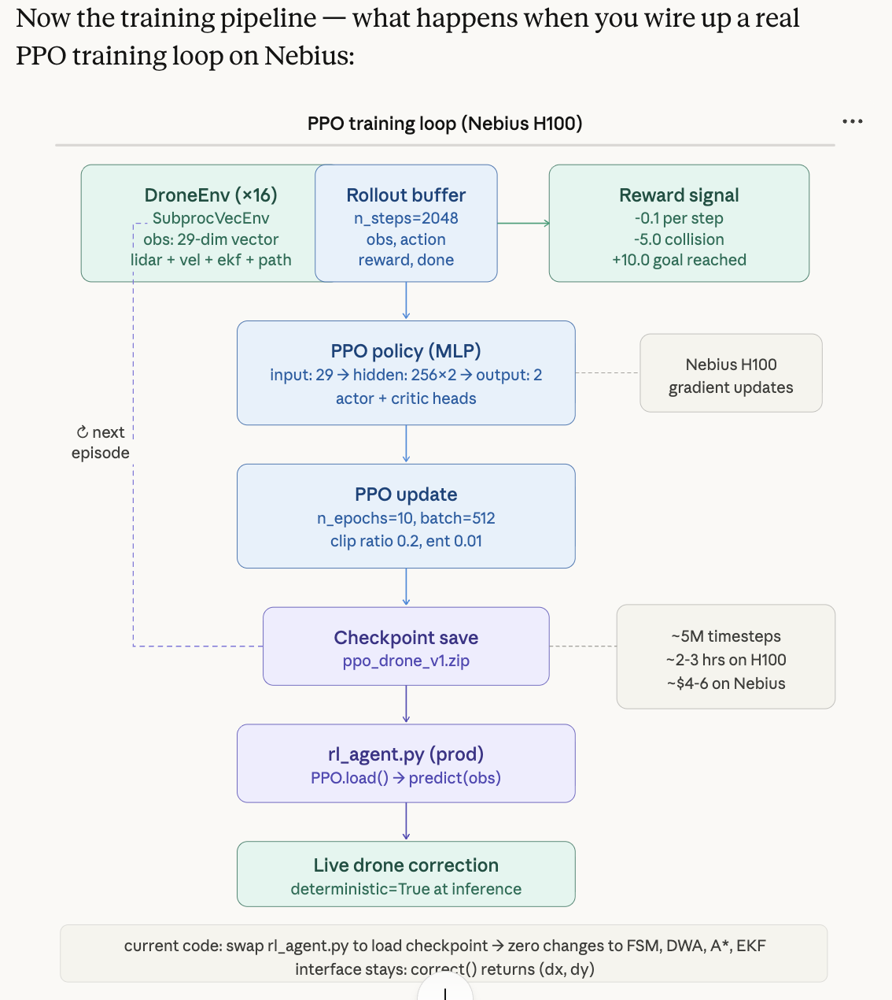

#  Autonomous Flight — Full Stack RL + SLAM Simulator

Dockerized autonomous flight simulator implementing the full KR Autonomous Flight
architecture stack: SLAM, EKF State Estimation, A* Global Planning, DWA Local
Planning, RL Course Correction, and a Flight State Machine.

## Architecture



RL

 

 RL

 

```
kr-autonomous-flight/
├── docker-compose.yml
│
├── backend/                        # Python / FastAPI
│   ├── Dockerfile
│   ├── requirements.txt
│   ├── src/
│   │   ├── main.py                 # FastAPI app + WebSocket /ws (30 fps tick loop)
│   │   └── world.py                # 2D grid world + obstacle management
│   ├── planners/
│   │   ├── astar.py                # A* global planner (8-connected, min-heap)
│   │   ├── dwa.py                  # Dynamic Window Approach local planner
│   │   └── rl_agent.py             # RL correction agent (Q-learning policy)
│   ├── estimator/
│   │   └── ekf.py                  # Extended Kalman Filter (predict + update)
│   └── statemachine/
│       └── fsm.py                  # 8-state flight FSM with guarded transitions
│
└── ui/                             # React 18 / nginx
    ├── Dockerfile                  # Multi-stage: node:20 build → nginx:1.25 serve
    ├── nginx.conf                  # SPA routing + gzip + cache headers
    ├── package.json
    ├── public/
    │   └── index.html
    └── src/
        ├── App.js                  # Root layout + WebSocket wiring
        ├── App.css                 # Global layout styles
        ├── hooks/
        │   └── useWebSocket.js     # WS connection + apiPost helper
        └── components/
            ├── TopBar.js           # Badge row + connection indicator
            ├── WorldCanvas.js      # Canvas renderer (rAF draw loop)
            ├── Sidebar.js          # FSM grid, EKF, SLAM, RL panels + log
            └── ControlBar.js       # Buttons + speed slider → REST API calls
```

## Quickstart

```bash
# 1. Clone / enter directory
cd kr-autonomous-flight

# 2. Build and start both services
docker compose up --build

# 3. Open browser
#    UI  → http://localhost:3000
#    API → http://localhost:8000/docs   (Swagger)
#    WS  → ws://localhost:8000/ws
```

## REST API

| Method | Path | Body | Description |
|--------|------|------|-------------|
| GET  | `/health` | — | Health check |
| POST | `/goal` | `{col, row}` | Set navigation goal |
| POST | `/obstacle` | `{col, row, width, height}` | Add dynamic obstacle |
| POST | `/reset` | — | Full simulation reset |
| POST | `/pause` | — | Toggle pause/run |
| POST | `/rl/toggle` | — | Enable / disable RL agent |
| POST | `/fault` | — | Inject EKF sensor fault |
| POST | `/speed/{value}` | — | Set simulation speed (0.5–4.0) |

## WebSocket

`ws://localhost:8000/ws` — streams full simulation state JSON at 30 fps:

```json
{
  "sim_time": 1234,
  "drone": { "x": 100.0, "y": 80.0, "vx": 0.5, "vy": 0.2, "heading": 0.38 },
  "goal": { "x": 500.0, "y": 400.0 },
  "global_path": [[4,5],[4,6],...],
  "lidar_rays": [{ "x": 120.0, "y": 60.0, "hit": true }],
  "slam_map": [[...]], 
  "fsm_state": "NAVIGATING",
  "ekf": { "x": 99.8, "y": 79.5, "P_trace": 0.42, "bias": 0.001, "innovation": 0.12 },
  "slam": { "mapped_pct": 34, "confidence": 87, "loop_closures": 2 },
  "planning": { "path_nodes": 18, "obs_avoided": 3 },
  "rl": { "reward": 5.21, "corrections": 4, "q_value": 0.72, "enabled": true },
  "fault_active": false,
  "events": [{ "t": 1230, "kind": "fsm", "msg": "FSM: NAVIGATING → AVOIDING" }]
}
```

## System Interaction

```
Sensors (LiDAR sim)
      │
      ▼
   SLAM map  ──────────────────────────────► A* Global Planner
      │                                           │ global_path
      ▼                                           ▼
  EKF Estimator  ──► estimated pose ──► DWA Local Planner
      │                                           │ (vx, vy)
      │                                           ▼
      └─────────────────────────────► RL Correction Agent
                                                  │ (dx, dy)
                                                  ▼
                                        Flight State Machine
                                          IDLE → TAKEOFF
                                          → NAVIGATING → AVOIDING
                                          → RL_CORRECT → REPLAN
                                          → LAND ← FAULT
```

## Development

```bash
# Backend only (hot reload)
cd backend && pip install -r requirements.txt
uvicorn src.main:app --reload --port 8000

# UI only (dev server)
cd ui && npm install && npm start
# → http://localhost:3000 (proxies /api to backend:8000)
```
